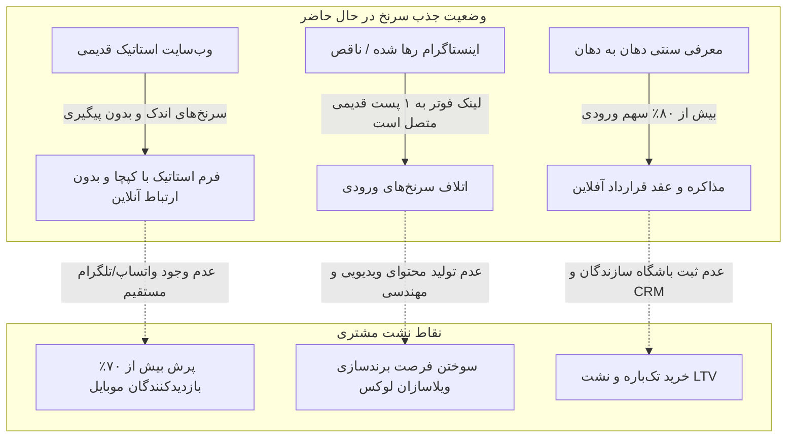
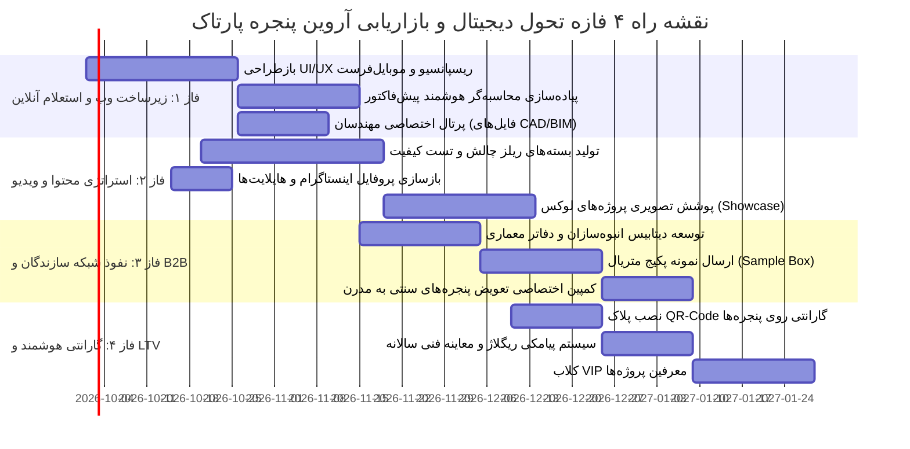
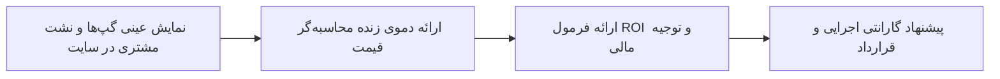

# 📊 گزارش تحلیل اختصاصی کسب‌وکار «شرکت آروین پنجره پارتاک» و استراتژی فروش پکیج رشد (Pitch Deck)

> **هدف سند:** کالبدشکافی وضعیت فعلی برند، شناسایی گلوگاه‌های درآمدی و اتلاف مشتری در زنجیره فروش، و تدوین نقشه راه ۴ فازه تحول دیجیتال، سئو، ویدیو مارکتینگ و اتوماسیون B2B جهت ارائه یک پیشنهاد غیرقابل‌رد (Unbeatable Offer) به هیئت مدیره **شرکت آروین پنجره پارتاک (اصفهان نوین سابق)**.

---

## 📌 ۱. اطلاعات شناسنامه‌ای و هویت کسب‌وکار

بر اساس داده‌های استخراج‌شده از وب‌سایت رسمی و پرتال اجرایی شرکت:

| شاخص | مشخصات شناسنامه‌ای و ثبتی | وضعیت اعتبارسنجی داده |
| :--- | :--- | :---: |
| **نام تجاری شرکت** | شرکت آروین پنجره پارتاک (سهامی خاص) / گروه صنعتی اصفهان نوین سابق | ✅ VERIFIED (منبع: وب‌سایت رسمی arvinpanjereh.com) |
| **سال تأسیس اولیه** | سال ۱۳۸۵ خورشیدی (۲۰۰۶ میلادی) در قالب کارگاه تخصصی درب و پنجره | ✅ VERIFIED (منبع: بخش تاریخچه شرکت) |
| **جهش کارخانه‌ای** | افزایش فضای تولید به ۱۵۰۰ مترمربع در سال ۱۳۹۳ با ماشین‌آلات مدرن اروپایی | ✅ VERIFIED (منبع: بخش درباره ما و تاریخچه) |
| **ثبت رسمی هلدینگ** | ثبت رسمی برند و هلدینگ آروین پنجره پارتاک در سال ۱۴۰۰ | ✅ VERIFIED (منبع: تاریخچه وب‌سایت) |
| **آدرس دفتر مرکزی** | اصفهان، خیابان محتشم کاشانی، روبروی پست بانک مرکزی، ساختمان نوید، طبقه ۶ | ✅ VERIFIED (منبع: صفحه تماس با ما) |
| **آدرس کارخانه** | اصفهان، خیابان امام خمینی، خیابان بسیج، کوچه ورزشگاه، بن‌بست قربانی، پلاک ۵۰ | ✅ VERIFIED (منبع: صفحه تماس با ما) |
| **خطوط تلفن دفتر** | ۰۳۱-۴۱۴۴ (خط چهار رقمی) \| ۰۳۱-۳۱۳۱۳۱۶۰ \| ۰۳۱-۳۱۳۱۳۱۵۰ | ✅ VERIFIED (منبع: صفحه تماس با ما) |
| **خطوط تلفن کارخانه** | ۰۳۱-۳۳۶۸۷۵۶۱ \| ۰۳۱-۳۳۶۸۷۵۶۶ | ✅ VERIFIED (منبع: صفحه تماس با ما) |
| **پایگاه اینترنتی** | `https://arvinpanjereh.com/` (دارای ساب‌فولدرهای `/en/` و `/ar/`) | ✅ VERIFIED |
| **زیرساخت فنی وب‌سایت** | سرور Kestrel (ASP.NET Core)، هاستینگ PleskWin، توسعه توسط Raysaz IT | ✅ VERIFIED (منبع: هدرهای HTTP سرور) |
| **مدل درآمدی (B2B / B2C)** | طراحی، مهندسی محاسبات، تولید صنعتی و اجرای نماهای مدرن و درب/پنجره | ✅ VERIFIED |
| **ادعای آماری سایت** | بیش از ۱۵ سال سابقه، ۳,۰۰۰ پروژه اجرا شده، ۲,۰۰۰ کارفرما/مشتری | ⚠️ UNVERIFIED ESTIMATE (ادعای ثبت‌شده در لندینگ سایت؛ نیازمند تطبیق با اسناد رسمی) |

### سبد محصولات و خدمات اجرایی مهندسی:
1. **درب و پنجره دوجداره اختصاصی و ترمال‌بریک (Thermal Break)**: لیفت اند اسلاید (Lift & Slide)، مونوریل، آکاردئونی، جام بالکنی، نرمال، بازشوهای ۲ جهته.
2. **نمای کرتین وال / لامل (Curtain Wall - Lamella)**: سیستم‌های Cap، Face Cap، U-Channel، اسکای‌لایت شیشه‌ای (Skylight) و سیستم‌های Add-on.
3. **نمای شیشه‌ای فریم‌لس (Frameless)**: شیشه‌های دوجداره و لمینت سکوریت بدون فریم آلومینیومی بیرونی.
4. **نمای کامپوزیت آلومینیوم**: پنل‌های ضدحریق آلومینیوم کامپوزیت تجاری و بانکی.
5. **نمای چوب طبیعی ترموود (Thermowood)**: سازگار با آب‌وهوای مختلف جهت پروژه‌های ویلایی و لوکس.
6. **سرامیک خشک و لوور آلومینیومی**: پوسته‌های مدرن، استرچ متال و شیدرهای کنترل تابش.
7. **نرده و حفاظ استیل و شیشه‌ای**: هندریل‌های شیشه‌ای مدرن (Glass Railing) و حفاظ‌های بانکی ضدسرقت.
8. **سقف کاذب آلومینیومی و آکوستیک**: تایل‌های دکوراتیو و سیستم دامپا.
9. **پارتیشن اداری دوجداره**: پارتیشن‌های مدولار آلومینیومی پرده‌خور.

### فهرست اعتبارساز مشتریان شاخص و پروژه‌ها (Social Proof):
- **بخش بانکی و دولتی**: شعب بانک مهر اقتصاد، بانک صادرات یاسوج، بانک قوامین، شهرداری منطقه ۱۳ اصفهان، سازمان ثبت اسناد سودان جی، پزشکی قانونی باغ رضوان.
- **تعاونی‌های مسکن بزرگ**: تعاونی مسکن پرشیا فلز، جهاد کشاورزی، ارتش مراتو، مسکن بانک ملی، فرهنگیان نواحی ۱ و ۴ اصفهان.
- **مجتمع‌های تجاری و پزشکی**: سیتی‌سنتر شاهین‌شهر، مرکز پزشکی حضرت ابوالفضل (ع)، مجتمع تجاری اداری مهستان نقش‌جهان، مجتمع‌های تجاری آقدادی، زارعان، حاجیان، فصیحی و طاووسی.
- **پروژه‌های ویلایی و مسکونی لوکس**: دهکده زیتون (ویلای مهندس موسوی)، پروژه‌های مسکونی مهندسین یارامیری، باقری، باقرهادی، فرهنگ، نصر، هرندی، توسلی و دریابیگی.

---

## 🔍 ۲. کالبدشکافی وضعیت فعلی (Current State Diagnosis)

با وجود کارنامه درخشان مهندسی، کارخانه ۱۵۰۰ متری مجهز و اجرای پروژه‌های شاخص، سازوکار بازاریابی و فروش دیجیتال مجموعه در **سال ۱۴۰۰ منجمد شده است** و در تطابق با پتانسیل واقعی برند نیست.

### ۱. آسیب‌شناسی فنی و تجربه کاربری وب‌سایت (UX / Technical Audit)
- **فرم تماس سنتی با مانع کپچا (High Friction Form)**: کاربر در صفحه تماس با یک فرم ASP.NET قدیمی همراه با تصویر Captcha مواجه می‌شود. در صنعت ساختمان که تصمیم‌گیرندگان (سازندگان، معماران، پیمانکاران) بیش از ۸۰٪ با موبایل در کارگاه یا دفتر جستجو می‌کنند، وارد کردن کپچای عکسی بالاترین نرخ انصراف (Drop-off) را ایجاد می‌کند.
- **فقدان دکمه شناور چت آنی (No WhatsApp/Telegram Live Chat)**: هیچ ابزار ارتباطی سریعی برای ارسال عکس نقشه نما، پلان پنجره‌ها یا فایل ابعاد در سایت تعبیه نشده است.
- **لینک اشتباه اینستاگرام در فوتر سایت**: آیکون اینستاگرام در فوتر سایت به جای لینک پروفایل اصلی، به نشانی یک پست خاص قدیمی با کد `CLUAs4-hO9Z` هدایت می‌شود! این خطای فاحش فنی باعث می‌شود هر کاربری که روی آیکون کلیک می‌کند نتواند پیج را فالو کند یا استوری‌های روز را ببیند.
- **خاموشی کامل بلاگ و بازاریابی محتوا**: از تاریخ ۲۹ تیر ۱۴۰۰ (بیش از ۵ سال) حتی یک مقاله فنی یا گزارش تصویری پروژه منتشر نشده است. این موضوع به الگوریتم‌های گوگل سیگنال «سایت غیرفعال» می‌دهد و رتبه‌های کلمات کلیدی کلیدی را کاهش می‌دهد.
- **خالی بودن تگ‌های متای صفحه پروژه‌ها**: تگ‌های `<meta name=keywords>` و `<meta name=description>` در صفحه حیاتی `/projects` کاملاً تهی هستند و شانس ایندکس شدن تصاویر پروژه‌ها در Google Images صفر است.
- **فقدان اسکیما و داده‌های ساختاریافته (Schema.org)**: تگ‌های `LocalBusiness`، `Organization` و `Project` در کد صفحات وجود ندارند.

---

## ⚡ ۳. نقاط ضعف کلیدی و گلوگاه‌های درآمدی (Bottlenecks & Revenue Leaks)

| سرفصل گلوگاه | وضعیت فعلی برند آروین پنجره | اثر مالی و اتلاف درآمدی | راهکار سیستمی جایگزین |
| :--- | :--- | :--- | :--- |
| **تله استعلام سنتی قیمت** | فرآیند استعلام منوط به تماس تلفنی یا حضور کارشناس است؛ عدم وجود برآوردگر آنلاین قیمت | از دست رفتن سازندگان پرمشغله و ویلاداران مدرن که نیاز به مظنه سریع دارند | **محاسبه‌گر آنلاین قیمت و متراژ نما و پنجره** بر اساس سیستم و یراق‌آلات |
| **نشت ارزش طول عمر مشتری (LTV)** | بعد از نصب پروژه، ارتباط با کارفرما قطع می‌شود؛ گارانتی کاغذی و پیگیری صفر | از دست رفتن پروژه‌های بعدی سازنده و عدم دریافت پورسانت/سفارشات معرفی | **سامانه گارانتی دیجیتال QR-Code** متصل به پروفیل‌ها با سرویس دوره‌ای ریگلاژ |
| **غیبت در ویدیو مارکتینگ لوکس** | اتکا به عکس‌های ثابت با کادربندی غیرحرفه‌ای از پروژه‌های تمام‌شده | باختن پروژه‌های فوق‌لوکس اصفهان، کیش و تهران به رقبای پر سر و صدا | **کمپین ویدیویی سینمایی** (تست نفوذ باران، آکوستیک، لیفت‌اسلاید با ۱ انگشت) |
| **پرتال تخصصی معماران (B2B)** | معمار و طراح جزئیات فایل DWG، دیتیل لامل، و ممان اینرسی پروفیل را پیدا نمی‌کند | حذف شرکت از لیست متره و برآورد دفاتر مشاور و آرشیتکت‌های شاخص | **باشگاه آرشیتکت‌ها** + دانشنامه فایل‌های CAD/BIM و مقاطع پروفیل |
| **نبود کاتالوگ دیجیتال تعاملی** | کاتالوگ کاغذی یا PDF سنگین با دانلود کند | ناتوانی تیم فروش در ارائه آنی در جلسات هلدینگ‌های ساختمانی | **میکروسایت کاتالوگ هوشمند تعاملی ۳D** با قابلیت انتخاب رنگ آنادایز |

---

## 🚀 ۴. نقشه راه تحول و سیستم‌سازی بازاریابی (Marketing System & Roadmap)

نقشه راه اجرایی در ۴ فاز کلیدی و به هم پیوسته طراحی شده است:

---

### 🌐 فاز ۱: زیرساخت وب‌سایت مدرن و محاسبه‌گر هوشمند B2B
1. **طراحی لندینگ اختصاصی لامل و پنجره‌های فوق مدرن**:
   - لودینگ زیر ۲ ثانیه، بهینه‌سازی شده برای موبایل با دکمه‌های مستقیم تماس و واتساپ مهندسی.
   - گالری تمام‌عرض اسلایدی بدون پرش، با نمایش دیتیل گسکت‌های EPDM و پلی‌آمیدهای ۲۴ تا ۳۴ میلی‌متری.
2. **محاسبه‌گر پیش‌فاکتور تخمینی (Smart Proforma Estimator)**:
   - کاربر ابعاد تقریبی (عرض و ارتفاع) را وارد می‌کند.
   - انتخاب نوع سیستم: (ترمال‌بریک کشویی، لیفت اند اسلاید، لامل فریم‌لس، لامل کپ).
   - انتخاب نوع شیشه: (دوجداره دودی، ۶+۴ سوپرکلیر گاز آرگون، لمینت ضدگلوله).
   - خروجی: صدور آنلاین پیش‌فاکتور تخمینی PDF با سربرگ شرکت آروین پنجره پارتاک + ارسال مستقیم به واتساپ واحد فروش.
3. **پورتال آرشیتکت‌ها و دانلود فایل‌های فنی**:
   - دانلود مستقیم دیتیل‌های DWG اتوکد، مقاطع لامل، دفترچه محاسبات استاتیکی، و جدول ممان اینرسی برای دفاتر معماری (ایجاد انگیزه قوی برای مشخص کردن برند آروین پنجره در نقشه‌های فاز ۲ شهرداری).

---

### 🎬 فاز ۲: استراتژی اینستاگرام و سناریوهای ویدیویی ویروسی

بخش عمده رقبای پنجره دوجداره صرفاً تصاویر خام کارگاهی منتشر می‌کنند. آروین پنجره باید موضع **«مرجع مهندسی و تجمل کاربردی نما»** را تصاحب کند.

#### ساختار هایلایت‌های حرفه‌ای:
`[محاسبه قیمت]` \| `[پروژه‌ها]` \| `[تست کیفیت]` \| `[کارخانه ما]` \| `[رضایت کارفرمایان]` \| `[دیتیل اجرایی]`

#### ۳ سناریوی ریلز ویدیویی با نرخ تبدیل بالا:

##### سناریوی ۱: تست شوکه‌کننده آکوستیک و عایق صدا (The Decibel Test)
- **قلاب (۰ تا ۳ ثانیه)**: مجری جلوی پنجره بسته یک مجتمع کنار اتوبان خیام یا امام خمینی اصفهان ایستاده؛ صدای وحشتناک بوق تریلی‌ها و موتورها شنیده می‌شود. مجری دستگاه دسی‌بل‌متر را نشان می‌دهد: **۸۸ دسی‌بل!**
- **داستان (۳ تا ۲۰ ثانیه)**: با یک انگشت پنجره دوجداره ترمال‌بریک آروین پنجره را باز می‌کند، صدای خیابان انفجاری بلند می‌شود؛ دوباره دستگیره را می‌چرخاند و با صدای نرم چفت شدن قفل‌های قارچی، صدا به زیر ۳۲ دسی‌بل سقوط می‌کند و سکوت کامل اتاق را فرا می‌گیرد.
- **توضیح فنی (۲۰ تا ۳۰ ثانیه)**: نشان دادن ساختار گاز آرگون با خلوص بالای ۹۰٪ و گسکت‌های سیلیکونی سه‌ردیفه.
- **فراخوان (CTA)**: «اگر خواب راحت در خانه برات مهمه، کلمه "سکوت" رو کامنت کن تا ابعاد پروژت رو بررسی کنیم.»

##### سناریوی ۲: تست واقعی با یک انگشت (The 400kg Lift & Slide Test)
- **قلاب (۰ تا ۳ ثانیه)**: یک لنگه پنجره غول‌پیکر ۳ در ۳ متری با شیشه ضدگلوله سنگین به وزن ۴۰۰ کیلوگرم. یک دختربچه یا با نوک یک انگشت دستگیره را چرخانده و لنگه به نرمی یخ سر می‌خورد!
- **داستان**: نمایش یراق‌آلات آلمانی اصل (Roto یا Siegenia) و ریل استنلس استیل ضدسایش.
- **فراخوان**: «برای استعلام قیمت پنجره‌های سایز بزرگ ویلایی دایرکت پیام بده.»

##### سناریوی ۳: کالبدشکافی تقلب‌های بازار (Thermal Break vs Fake)
- **قلاب**: «چرا بعد از ۲ سال پنجره‌های گرون‌قیمتتون یخ می‌زنه و عرق می‌کنه؟»
- **داستان**: برش مقطعی پروفیل آلومینیومی استاندارد آروین پنجره دارای تیغه پلی‌آمید تقویت‌شده با الیاف شیشه در مقایسه با پروفیل‌های متفرقه بازار که از PVC ارزان یا پلاستیک بازیافتی استفاده می‌کنند. تست حرارت مستقیم با شعله‌افکن!

---

### 🏢 فاز ۳: سیستم بازاریابی مستقیم و نفوذ در شبکه B2B
1. **کمپین اختصاصی دفاتر مهندسی مشاور و آرشیتکت‌های اصفهان و تهران**:
   - استخراج لیست ۲۰۰ دفتر معماری رده الف.
   - طراحی و ارسال **«کیت نمونه مهندسی» (Architect Sample Box)**: یک جعبه شکیل شامل مقطع برش‌خورده پروفیل ترمال‌بریک آنادایز طلایی/مشکی مات، شیشه دوجداره با برش مینیاتوری نشان‌دهنده اسپیسر و گاز آرگون، و فلش‌مموری چوبی حاوی بلوک‌های اتوکد و رویت (Revit BIM).
2. **پوشش پروژه‌های شاخص در حال احداث (Radar Construction Lead)**:
   - شناسایی ساختمان‌های در مرحله سفت‌کاری و اسکلت فلزی/بتنی در مناطق مرداویج، مشتاق، مهرآباد، آبشار و چهارباغ بالا.
   - برقراری ارتباط مستقیم با سازنده و ارائه تحلیل انرژی و جدول مقایسه اتلاف حرارتی پنجره‌های استاندارد آروین در برابر پنجره‌های سنتی.

---

### 🛡️ فاز ۴: گارانتی دیجیتال با QR-Code و باشگاه سازندگان (LTV Engine)
1. **پلاک آلومینیومی / استیکر هولوگرام هوشمند با QR اختصاصی**:
   - روی کنج داخلی هر لنگه پنجره یا ورودی نمای کرتین‌وال، یک پلاک متالیک ظریف نصب می‌شود.
   - با اسکن کد توسط موبایل مالک، صفحه اصالت باز شده و موارد زیر نمایش داده می‌شود:
     * کد پیگیری اختصاصی پروژه و نام مهندس ناظر
     * تاریخ تحویل و مدت اعتبار گارانتی یراق‌آلات و عدم تغییر رنگ آنادایز
     * دکمه ۱-کلیک درخواست ریگلاژ دوره‌ای یا پولیش نما
2. **پیامک یادآوری سرویس فصلی (Retention Trigger)**:
   - ارسال پیامک در آبان‌ماه: «جناب مهندس ... با توجه به آغاز فصل سرما، جهت اطمینان از عملکرد صددرصدی عایق پنجره‌های پروژه ... تیم فنی آروین پنجره آماده بازدید رایگان است.»
   - این اقدام سبب می‌شود سازنده در پروژه‌های جدید خود به هیچ شرکت دیگری فکر نکند.

---

## 💎 ۵. نحوه ارائه و پروپوزال فروش (The Pitch Strategy)

هنگام حضور در جلسه با هیئت مدیره شرکت آروین پنجره پارتاک، ارائه باید کاملاً متمرکز بر **اعداد مالی، نرخ بازگشت سرمایه (ROI) و برطرف کردن ترس‌های کارفرما** باشد:

### ۱. مکالمه افتتاحیه و به تصویر کشیدن نشت درآمدی (Opening Hook):
> «جناب مهندس، شرکت شما در اصفهان صاحب یکی از مجهزترین خطوط تولید نما و پنجره ترمال‌بریک است؛ بیش از ۳ هزار پروژه موفق اجرا کردید از بانک مهر تا ویلاهای دهکده زیتون.  
> اما می‌دانید وقتی یک کارفرمای ویلاساز یا سازنده ۵۰ واحدی در مرداویج وارد سایت شما می‌شود چه اتفاقی می‌افتد؟  
> او با یک وب‌سایت مربوط به سال ۱۴۰۰ مواجه می‌شود که مقاله‌ای جدیدتر از ۳ سال پیش ندارد، اینستاگرامش به یک پست قدیمی هدایت می‌شود و برای یک استعلام ساده باید درگیر کپچای عکس‌دار شود!  
> در نتیجه، مشتری ثروتمند و آماده خریدی که شما برای ساخت هر متر مربع پنجره او حداقل ۱۰ تا ۲۵ میلیون تومان سود خالص دارید، ظرف ۱۰ ثانیه صفحه را می‌بندد و به سراغ رقبایی می‌رود که حتی یک‌دهم کارخانه شما ماشین‌آلات مدرن ندارند.»

### ۲. نمایش دموی آماده (Show, Don't Tell):
- قبل از جلسه، یک دموی موبایلی از **محاسبه‌گر پیش‌فاکتور آروین پنجره** آماده کنید.
- گوشی را به دست مدیرعامل بدهید: «ببینید، کارفرما طول و عرض را می‌زند، سیستم ترمال‌بریک را انتخاب می‌کند و ظرف ۵ ثانیه پیش‌فاکتور رسمی با لوگوی آروین پنجره روی واتساپش ارسال می‌شود.»

### ۳. معادله بازگشت سرمایه (ROI Justification):
- هزینه اجرای پکیج بازاریابی، سایت هوشمند و ویدیو مارکتینگ: رقمی در بازه استاندارد بازار.
- ارزش سود ناخالص تنها یک قرارداد پروژه مسکونی ۱۰ واحدی یا یک ویلای مدرن لامل: سود چند صد میلیون تومانی.
- **نتیجه‌گیری قطعی**: «این سیستم اگر در طول ۶ ماه تنها و تنها **یک قرارداد جدید** برای خط تولید لامل یا پنجره‌های لیفت‌اسلاید شما جذب کند، تمام هزینه سرمایه‌گذاری را بازگردانده و سود خالص مابقی پروژه‌ها رایگان خواهد بود.»

---

## 📝 ۶. خلاصه اجرایی و اقدامات فوری (Action Items)

| اولویت | اقدام اجرایی | زمان‌بندی پیشنهادی | مسئولیت |
| :---: | :--- | :---: | :---: |
| **۱** | **اصلاح فوری باگ آیکون اینستاگرام** در فوتر سایت و اتصال به پیج اصلی رسمی | ۴۸ ساعت اول | تیم فنی سایت |
| **۲** | **افزودن دکمه ارتباط سریع واتساپ/تماس مستقیم مهندسی** در تمام صفحات | ۴۸ ساعت اول | تیم طراحی و توسعه |
| **۳** | **به‌روزرسانی و تکمیل تگ‌های متای صفحه پروژه‌ها** جهت ایندکس تصاویر نمونه‌کارها | هفته اول | متخصص سئو |
| **۴** | **طراحی و پیاده‌سازی ابزار برآورد قیمت و پیش‌فاکتور هوشمند** | ماه اول | تیم نرم‌افزاری |
| **۵** | **آغاز ضبط ۳ قسمت اول ویدیوهای ریلز (تست دسی‌بل، تست لیفت‌اسلاید)** در کارخانه | ماه اول | تیم تولید محتوا |
| **۶** | **راه‌اندازی سامانه پلاک QR گارانتی هوشمند دیجیتال** | ماه دوم | مدیر فنی و CRM |

---
*گزارش تحلیلی تدوین‌شده بر اساس استانداردهای مهندسی سیستم‌های بازاریابی ساختمانی - ۱۴۰۵.*
